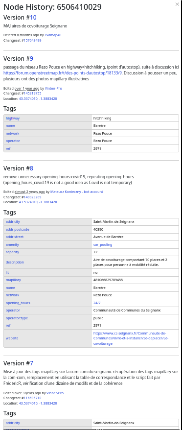
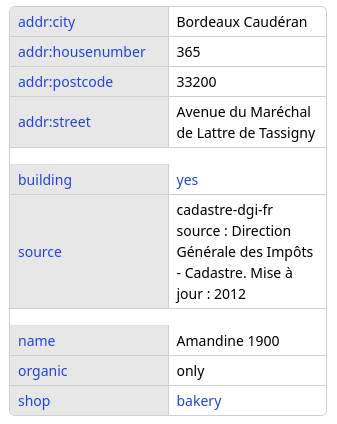

# OSM Logical History – From technical diffs to reconstructed semantic object history

By Frédéric Rodrigo, August 25, 2025.

## 1 Objective

The objective is to review the changes between two versions of OSM data in order to evaluate the quality of these changes and, if necessary, correct the data in OSM.

To do this, it is necessary to use a data differential between the two versions. The OSM differential format (“diff”) is relatively technical and low-level in terms of data structure. It is therefore difficult for humans to interpret and read. Here, we seek to establish a semantic, rather than technical, differential between the data before and after modification. We are only interested in this subject.

### 1.1 OSM Changesets and Diffs Problem

In OSM, changes are contributed in groups of modifications called “Changesets.” These are “Diffs”: data differentials with a set of metadata (date, contributor nickname, etc.). This differential simply contains the modified objects in their new versions.

Objects in OSM consist of free key-value attributes carrying semantics, as well as geometry (carried directly by points, or indirectly by segmented lines and relations). Objects also have meta-attributes, such as contributor nickname. These objects are versioned as they are modified, with version and deletion (“soft delete”) meta-attributes.

There is no requirement for semantic consistency in changesets. They can involve modifications to objects that are not related thematically or geographically. A changeset could add a house in Brazil and modify the shape of a road in Mongolia (although this is not recommended practice). Furthermore, unlike relational databases a changeset is not transactional. A changeset is a working session that can extend over time. It can even contain several versions of the same object.

This history structure of OSM objects and the nature of changesets present challenges for data analysis [^1].

A changeset is therefore a group of changes spread out geographically, semantically, and temporally.

### 1.2 Semantic issues raised by the structure of OSM data

The OSM data model is very simple and very open. All objects have attributes in the form of “free” key-value pairs, tied into a consensus of usage. These attributes define the semantics of the objects. There is therefore no equivalence with the thematic layers found in the GIS world. Objects can even have several semantics at once, and the number of semantic aspects can even depend from the viewpoint of the observer. For example, an object can be a building, a business, and an address all at once (which is not recommended practice, but such objects exist in large numbers).

There are also three types of objects that are not defined by attributes: points, segmented lines, and relations. Depending on the level of detail of the mapping and the intrinsic complexity of the object, an object can be modeled according to one of these three types. A segmented line does not have its own geometry, but references points. Note that in OSM, a polygon is one or more segmented lines in a loop, whose surface nature is defined only by the interpretation of attributes.

This modeling flexibility, while advantageous for contributors, complicates data consistency analysis [^2].

Although each object has an identifier, a version number, and a history in its meta-attributes, this history is primarily technical. For example, a school may initially be contributed as a point, which may be deleted before being re-mapped as a polygon. This is reflected in the history by the deletion of the point-type school object with a first technical identifier, followed by the creation of a segmented line-type school object with another technical identifier. There is therefore no link in the history between the two objects, although semantically they are the same school.

To take another, more complex example, a road can be split into several segments to carry different attributes, such as the maximum speed limit. One of the segments retains the identifier and link to the history, while the other segments are new objects with no link, either technical or historical.

It should be noted that objects may have “business” identifier or reference attributes, such as the reference number of a road shared by several sections or the unique reference of a fire hydrant.

The technical history of objects therefore does not allow for a semantic link to be made between objects before and after modification. An object can even retain its identifier and history, while changing all of its attributes and therefore its semantics.

### 1.3 Require to work at the semantic level

As identified by Padilla-Ruiz et al. (2017)[^3] in their classification of digital map conflation processes. To limit the analysis to actual changes in OSM data, it is necessary to process the data at the semantic level.

In fact, deleting a fire station to transform it from a node object type to a polygon is equivalent to a deletion and creation at the data model level. But at the semantic level, this should be interpreted as a simple geometry modification.

In addition, objects can be modified while remaining present in another form. For example, an object with building, business, and address attributes can be split into three separate objects, whose overall semantics remain equivalent to those of the original object. Depending on the quality and change monitoring rules that one wishes to follow, this can be considered a simple modification of geometry, or even not considered a change as long as the location remains the same.

## 2 Context of the need

The approach detailed here derives from a need of the Clearance project. Clearance is a tool for synchronizing a copy of an OSM database. As its name suggests, data synchronization is subject to control. This synchronization is not done uniformly, both geographically and temporally. Only changes that locally (geographically) meet quality criteria are synchronized. Changes are not processed chronologically, but by rearranging the modified objects into “local” groups. The aim is to ensure the local consistency of the synchronized data. These groups of local changes are called “LoCha” (Mohapatra, 2019)[^4].

This is where the need to analyze the difference between data already synchronized in the OSM copy and new data coming in from contributions made to OSM comes in. The data to be synchronized is put into quarantine while its quality is validated and corrected. If this data meets the quality criteria locally (geographically), it is integrated into the synchronized copy. Otherwise, the data in quarantine is updated (still in the quarantined copy) until it meets the quality criteria. This approach to reorganizing changes by LoCha allows problematic areas to be put on hold while continuing to update data elsewhere.

To evaluate the quality criteria, it is easier to do so on a high-level semantic representation rather than at the technical format level of OSM diffs. It is for this task that we need this semantic differential between two versions of OSM data.

The concepts and implementations detailed here are intended to be more generic than the scope for which we developed them.

Due to the issues described above, OSM technical identifiers are neither permanent nor reliable. Furthermore, reconstructing the semantic history of objects could contribute to discussions on the topic of permanent identifiers. (https://giswiki.hsr.ch/Permanent_ID_for_OSM https://wiki.openstreetmap.org/wiki/Permanent_ID https://wiki.openstreetmap.org/wiki/Persistent_Place_Identifier )

## 3 Selection and preparation of OSM data

The data to be compared is in the OSM data schema. It is a relational structure, not geometric, nor organized by thematic layers, and not particularly suitable for processing. It is necessary to calculate the complete geometries of the objects and, for example, determine whether a segmented line in loop is a polygon or not.

On the other hand, objects that do not change are excluded from the analysis because they have no history of modification.

## 4 Conflation

Conflation consists of finding objects whose identity appears to correspond between the before and after versions. This also makes it possible to identify objects, in the semantic sense, that have been newly created or deleted. This comparison is made on the basis of both the semantics of OSM tags and geometry.

This conflation is performed iteratively on a set of criteria.

The approach described here is the one currently implemented. Improvements are possible.

### 4.1 Reconciliation by references

The first criterion for finding objects is to use their business references. In OSM, there may be several reference tags.

If in the before and after versions we find a single OSM object with the same set of references, then we consider that a match.

The reference tags used are the “ref” tag and those beginning with “ref:”.

In the future, we could handle cases where several OSM objects share the same references, as is the case for roads.

### 4.2 Reconciliation by distance

For all remaining objects, a distance matrix is calculated between all OSM objects in the before version and those in the after version. This is not a geometric distance, but a distance measuring semantic and spatial similarity.

The object before and the object after with the smallest distance, and less than a maximum distance, are considered to be in correspondence.

These objects are removed from the matrix and the process is repeated until there are no more objects in correspondence.

The iterative approach is similar to Volz, Steffen. (2006)[^5]. This approach is not without drawbacks. In the future, rather than iterating, we could look to minimize the sum of the distances between paired objects.

### 4.3 Concept of distance

The distance used for matching is not only the Euclidean geometric distance, but is based on the semantics of the tags and geometric shapes.

As a result, the matrix is not complete; it is only defined for objects that are comparable to each other.

#### 4.3.1 Geometric distance

For objects without geometry, such as certain OSM relations, or invalid geometries, the distance is undefined. These objects are therefore not matchable.

Identical geometries have a distance of 0.

For points, the Euclidean distance is interpolated non-linearly in the interval [0; 1]. The idea is to differentiate small distances more than large ones. The value 1 is obtained for the maximum permitted distance (200 m). Beyond this, the distance is no longer defined, and therefore the approximation is impossible.

For other types of geometries, if there is no intersection, we use the same distance formula as for points, but in the interval [0.5; 1]. A penalty of 0.5 is introduced for geometries without intersection.

In the case of an intersection, if one of the two geometries is completely included in the other, the distance is then evaluated as 0 (see below for the reason with partial matches). Otherwise, the ratio between the size of the intersection and the size of the union is calculated (value between 0 and 1), in other words that the Jaccard distance, which is a proven method for performing conflations (Li & Goodchild, 2011). This “size” can be either the length or the area, depending on the case.

These calculations are performed using buffers to handle cases such as quasi-intersections or quasi-inclusions.

This geometric distance has a value between 0 and 1.

#### 4.3.2 Semantic distance between tags

OSM tags are free-text key-value pairs. However, not all tags have the same role or importance and should be weighted as proposed by Samal et al. (2004)[^6].

- **Concept hierarchy tags**: in OSM, there is a nomenclature of tags defining the nature of objects. The keys and values are codified. For example, “highway=motorway” to indicate that a road is a motorway; or “tourism=information” + “information=board” + “board_type=history” for a tourist information board about the history of a place.
- **Additional attribute tags** with free or fixed values, such as “name=*” for the name, or “wheelchair=yes” to indicate that the object is wheelchair accessible.

To establish a distance between object tags, we will separate the tags into two subgroups: those defining a first-level hierarchical nature and the others.

Objects that do not share top-level hierarchical keys are considered non-comparable, and the semantic distance between them is not defined.

An object in OSM can have several top-level tags, for example “amenity=recycling” + “landuse=industrial”.

Among these top-level tags, there are two types of values:
- Those for which the value changes the nature (“amenity=recycling” or “amenity=driving_school”). Although the key is the same, the objects are not similar. The distance is defined as 1.
- Those for which the value gives a level for a type of object (“highway=motorway,” “highway=unclassified”). The objects are of the same type and comparable to each other. The distance is defined as 0.5.

If the keys and values are identical, the distance is 0. If the keys or values exist for only one of the two objects, the distance is 1.

The distance of the tags in this first subgroup is obtained by averaging the individual distances of the tags.

For the second subgroup of additional tags, for each identical key, the Levenshtein distance between the values (number of different characters between the two values) is calculated, normalized between 0 and 1. Then we average all the tags in this second group.

Finally, the distances of the two subgroups are added together and divided by two to obtain a semantic distance of the tags between 0 and 1.

| Before             | After                       | Tag distance | Group distance | Total distance |
|--------------------|-----------------------------|--------------|-----------------|-----------------|
| shop=bakery        | shop=bakery                 | 0            |                 |                 |
|                    | craft=bakery                | 1            |                 |                 |
|                    |                             |              | 0,5             |                 |
| name=Amandine 1900 | name=Amandine               | 0,38         |                 |                 |
|                    | addr:street=Avenue Tassigny | 1            |                 |                 |
|                    |                             |              | 0,69            |                 |
|                    |                             |              |                 | 0,59            |

[Example of calculating the distance between tags before and after.]

This approach of weighting attributes according to their semantic importance is inspired by the work of McKenzie et al (2014) [^7] on matching user-generated points of interest. For the second subgroup, the nature of the tags may be used to calculate the distance rather than using a Levenshtein distance that is completely unrelated to the semantics of the content.

###  4.4 Partial matching

When a before object is a sub-part of the after object, we will cut the geometry to perform only a partial match, as proposed by Adams et al (2015)[^8] for roadways.

This case occurs frequently with roads that can be segmented to support different attributes, such as speed changes.

The remaining part of the object will be reintroduced into the distance matrix and will be available for new matches.

In the future, we could also imagine making partial matches of tags in cases where there are several top-level tags.

### 4.5 Simplify

After these matches, there may still be complete or partial objects remaining. In order to improve interpretation, the result is simplified. The remaining partial objects are merged back with the original OSM objects that have already been matched. This is particularly the case for objects whose geometry has been enlarged and not split into several objects.

Objects may have changed semantics, and the objects before and after cannot be matched because they are different in nature. For example, a bank that has become a pizzeria. The semantic matching process will identify the deletion of a bank and the creation of a pizzeria, which is correct. However, these changes occur on the same OSM object and are not matched to anything. As a last resort, we will use the fact that the OSM technical identifier has not changed to match the objects anyway. Ultimately, it is indeed a bank that has become a pizzeria.

## 5 Implementation

This approach is implemented in the project [OpenStreetMap Logical History](https://github.com/teritorio/openstreetmap-logical-history).

The project also provides an API that allows you to calculate the semantic history of an area between two dates by retrieving OSM data from an Overpass instance. The result can be viewed here [OpenStreetMap Logical History](https://teritorio.github.io/openstreetmap-logical-history-component/).

## 6 Conclusion

This initial implementation of merging between two versions of OSM needs improvement, but it already provides better structuring of information and thus facilitates the review of changes by offering a history based on semantics, where objects do not have only one predecessor or successor in the history.

In addition to the demonstration project, this implementation is already in place in the Clearance project, where it helps to detect changes that actually require human review.

This approach brings conflation to the OSM data history by recreating a semantic history rather than a technical history.

The approach outlined here opens up possibilities for offering an alternative to the need for unique identifiers and provides a basis for better evaluating changes in OSM data over time.

[^1]: Girres, Jean-François & Touya, Guillaume. (2010). Quality Assessment of the French OpenStreetMap Dataset. T. GIS. 14. 435-459. 10.1111/j.1467-9671.2010.01203.x.

[^2]: Fan, Hongchao & Zipf, Alexander & Fu, Qing & Neis, Pascal. (2014). Quality assessment for building footprints data on OpenStreetMap. International Journal of Geographical Information Science. 28. 700-719. 10.1080/13658816.2013.867495.

[^3]: Padilla-Ruiz, Marta & Lopez-Vazquez, Carlos. (2017). Measuring conflation success. Revista Cartográfica. 41-64. 10.35424/rcarto.v0i94.341.

[^4]: Mohapatra, Saurav (2019). MaRS: How Facebook keeps maps current and accurate.  https://engineering.fb.com/2019/09/30/ml-applications/mars/

[^5]: Volz, Steffen. (2006). An Iterative Approach for Matching Multiple Representations of Street Data. In: Hampe,M. (ed.); Sester,M. (ed.); Harrie, L. (ed.): Proceedings of the JOINT ISPRS Workshop on Multiple Representations and Interoperability of Spatial Data. Vol. XXXVI Part 2/W40, pp. 101-110. 36.

[^6]: Samal, Ashok & Seth, Sharad & Cueto, Kevin. (2004). A feature-based approach to conflation of geospatial sources. International Journal of Geographical Information Science. 18. 459-489. 10.1080/13658810410001658076.

[^7]: McKenzie, Grant & Janowicz, Krzystof & Adams, Benjamin. (2014). A weighted multi-attribute method for matching user-generated Points of Interest. Cartography and Geographic Information Science. 41. 125-137. 10.1080/15230406.2014.880327.

[^8]: Adams, Benjamin & McKenzie, Grant & Gahegan, Mark. (2015). Frankenplace: Interactive Thematic Mapping for Ad Hoc Exploratory Search. 10.1145/2736277.2741137.

[^9]: Li, Linna & Goodchild, Michael. (2011). An optimisation model for linear feature matching in geographical data conflation. International Journal of Image and Data Fusion. 2. 309-328. 10.1080/19479832.2011.577458.

[^10]: Müslüm Hacar and Türkay Gökgöz (2019). A New, Score-Based Multi-Stage Matching Approach for Road Network Conflation in Different Road Patterns
